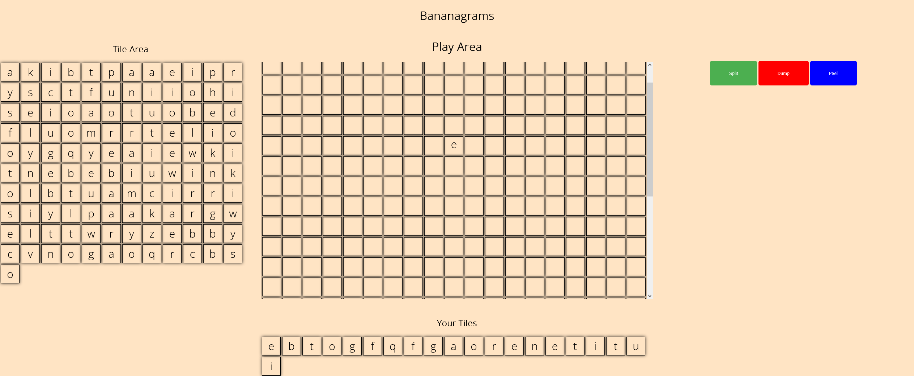

# BananaGram

## Description

BananaGram is a game that allows users to to create words using randomly selected letters. The game is similar to Scrabble, but without the board. The game is played by 2-8 players. Each player starts with 21 tiles. The first player to use all of their tiles wins.

## Icebox Features

* Add a timer to the game
* Make it responsive design
* Add a feature that allows users to play against the computer or another player over firebase
* Make the overflow work with the x axis
* Add the different game modes avaliable to a tabletop Bananagram gram
* Implement a Dictionary API to check to see if words are correct

## Technologies Used

* HTML
* CSS
* JavaScript

## How to Play

When you click on the split button, you will be given 21 tiles. You can then click on the tiles to create words. If you want to remove a tile, you can click on the tile again. If you run out of tiles, you can press the peel button which will give you a new tile which you can use. You can also press the dump button which will hand 1 tile back to the tile area and you will recieve 3 tiles back.

## Image of the game

